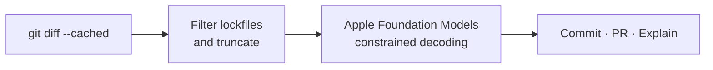

<p align="center">
  <strong>English</strong> · <a href="README.pt.md">Português</a>
</p>

# git-afm

<p align="center">
  <a href="https://github.com/meschkemaes/git-afm/actions/workflows/ci.yml"></a>
  <a href="LICENSE"></a>
  <a href="https://www.python.org/"></a>
  <a href="https://developer.apple.com/documentation/foundationmodels"></a>
  <a href="#privacy"></a>
</p>

On-device Conventional Commits, pull request descriptions, and diff explanations — powered by [Apple Foundation Models](https://developer.apple.com/documentation/foundationmodels).

`git-afm` reads your staged `git diff` and produces structured output locally on Apple Silicon. No API keys, no cloud inference, no token costs.

```text
Type: feat | Scope: auth
feat(auth): implement token verification logic

- Add authenticate_user helper function
- Validate token length and admin identity

[c] commit   [e] edit   [r] regenerate   [y] copy   [q] quit
```

## Contents

- [Requirements](#requirements)
- [Features](#features)
- [Installation](#installation)
- [Usage](#usage)
- [CLI reference](#cli-reference)
- [Commit types](#commit-types)
- [MCP server](#mcp-server)
- [How it works](#how-it-works)
- [Development](#development)
- [License](#license)

## Requirements

| Requirement | Details |
| --- | --- |
| Hardware | Apple Silicon (M1 or later) |
| OS | macOS with [Apple Intelligence](https://support.apple.com/en-us/117097) enabled in System Settings |
| Runtime | Python 3.10 or later |
| VCS | Git |

The Apple Foundation Models framework is only available on supported Macs with Apple Intelligence turned on. If the model is unavailable, `git-afm` exits with a clear error instead of falling back to a remote API.

## Features

- **Conventional Commits** from the staged diff (`feat`, `fix`, `refactor`, `perf`, `test`, `docs`, `chore`, `build`, `ci`), including optional scope and breaking-change (`!`) markers.
- **Constrained decoding** via `@fm.generable` — the model fills a typed schema, so you get a real commit object instead of brittle JSON parsing.
- **Pull request descriptions** (`--pr` / `git-afm-pr`) as Markdown with summary, key changes, and a verification checklist.
- **Diff explainer** (`--explain`) in English or Portuguese, without committing.
- **Interactive terminal UI** (Rich): commit, edit in `$EDITOR`, regenerate, copy, or quit.
- **macOS clipboard** integration through `pbcopy`.
- **Local MCP server** (`afm-mcp`) so Cursor, Claude Desktop, Windsurf, and similar clients can call the same on-device tools.

Lockfiles and minified bundles are omitted from the prompt; oversized diffs are truncated so they fit the on-device context window.

## Installation

Clone and install in editable mode:

```bash
git clone https://github.com/meschkemaes/git-afm.git
cd git-afm
python3 -m pip install -e .
```

Directly from GitHub:

```bash
python3 -m pip install "git+https://github.com/meschkemaes/git-afm.git"
```

Optional extras:

```bash
python3 -m pip install -e ".[mcp]"   # MCP server
python3 -m pip install -e ".[dev]"   # test suite
```

Git on macOS discovers executables named `git-<command>`, so after install both of these work:

```bash
git afm
git-afm
```

The package also installs `git-afm-pr` (shortcut for `git-afm --pr`) and `afm-mcp`.

## Usage

### Interactive commit

Stage the files you want in the commit, then generate a message:

```bash
git add -p
git afm
```

If nothing is staged but unstaged changes exist, `git-afm` asks whether to stage everything first.

### Stage all and generate

```bash
git afm -a
```

Equivalent to `git add -A` followed by generation.

### Portuguese output

```bash
git afm --pt
```

Commit subjects, bullet points, PR copy, and the action menu are generated in Portuguese. The Conventional Commit **type** (`feat`, `fix`, …) stays in English, as the spec requires.

### Pull request description

```bash
git afm --pr
# or
git-afm-pr
```

Output is Markdown ready for GitHub or GitLab:

```markdown
## Summary
…

## Key Changes
- …

## Verification & Testing
- [ ] …
```

### Explain the diff

```bash
git afm --explain
git afm --explain --pt
```

Prints a short natural-language explanation and exits without committing.

### Extra context

Guide the model with intent the diff does not make obvious:

```bash
git afm -m "this is a hotfix for the login timeout in production"
```

### Non-interactive and dry-run

```bash
git afm -y                 # commit immediately
git afm --dry-run          # print only
git afm --dry-run --copy   # print and copy
```

## CLI reference

| Flag | Description |
| --- | --- |
| `-a`, `--all` | Stage all changes (`git add -A`) before generating |
| `--pr` | Generate a Markdown pull request description |
| `--explain` | Explain the diff in plain language; do not commit |
| `-y`, `--yes` | Commit (or stage, when needed) without confirmation |
| `-d`, `--dry-run` | Print the result without committing |
| `--pt` | Generate text in Portuguese (default: English) |
| `--copy` | Copy the result to the macOS clipboard |
| `-m`, `--context TEXT` | Extra developer intent passed to the model |
| `-v`, `--version` | Print the version and exit |

## Commit types

| Type | Use when |
| --- | --- |
| `feat` | A new feature |
| `fix` | A bug fix |
| `refactor` | A code change that neither fixes a bug nor adds a feature |
| `perf` | A performance improvement |
| `test` | Adding or correcting tests |
| `docs` | Documentation only |
| `chore` | Maintenance that does not affect src or tests |
| `build` | Build system or dependencies |
| `ci` | CI configuration |

Breaking changes get a `!` after the type (or `type(scope)!`) and a `BREAKING CHANGE` footer.

## MCP server

`git-afm` can expose the same on-device model as a [Model Context Protocol](https://modelcontextprotocol.io/) server.

```bash
python3 -m pip install -e ".[mcp]"
afm-mcp
```

### Tools

| Tool | Purpose |
| --- | --- |
| `generate_conventional_commit` | Conventional Commit message from a diff |
| `generate_pr_summary` | Markdown PR description from a diff |
| `explain_diff` | Plain-language explanation of a diff |

Each tool accepts `diff` (required), `language` (`en` or `pt`, default `en`), and — except `explain_diff` — optional `context`.

### Client configuration

Add the server to `mcp.json` (Cursor, Windsurf) or `claude_desktop_config.json`:

```json
{
  "mcpServers": {
    "apple-foundation": {
      "command": "python3",
      "args": ["-m", "git_afm.mcp_server"]
    }
  }
}
```

If the `afm-mcp` script is on your `PATH`:

```json
{
  "mcpServers": {
    "apple-foundation": {
      "command": "afm-mcp"
    }
  }
}
```

The Python used in `command` must be the same environment where `git-afm` (and the `mcp` extra) is installed.

## How it works



1. The CLI reads the staged diff (`git diff --cached`).
2. Noise is stripped: lockfiles (`package-lock.json`, `pnpm-lock.yaml`, `Cargo.lock`, …), minified assets, and source maps are omitted; large file hunks are truncated.
3. Apple Foundation Models fills a `@fm.generable` schema (`ConventionalCommit` or `PullRequestSummary`) through constrained decoding.
4. The result is rendered in the terminal. You commit, edit, regenerate, copy, or abort.

Inference runs on the Apple Neural Engine. Diffs never leave the machine.

### Privacy

There is no network client for generation. `git-afm` does not send diffs, commit messages, or prompts to a third-party API. Availability still depends on Apple Intelligence being enabled on the local Mac.

## Development

See [CONTRIBUTING.md](CONTRIBUTING.md).

```bash
python3 -m pip install -e ".[dev]"
python3 -m pytest tests/ -v -m "not integration"
```

| Module | Tests |
| --- | --- |
| `tests/test_models.py` | Commit / PR formatting, including breaking changes |
| `tests/test_git_utils.py` | Diff filtering, lockfile omission, truncation |
| `tests/test_ui.py` | Action-menu copy |
| `tests/test_engine.py` | On-device integration (requires Apple Intelligence) |

`test_engine.py` talks to the real Foundation Models runtime and is skipped when Apple Intelligence is unavailable. GitHub Actions runs the unit tests only.

## License

[MIT](LICENSE) © 2026 Lucas Meschke
