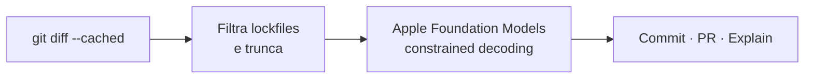

<p align="center">
  <a href="README.md">English</a> · <strong>Português</strong>
</p>

# git-afm

<p align="center">
  <a href="https://github.com/meschkemaes/git-afm/actions/workflows/ci.yml"></a>
  <a href="LICENSE"></a>
  <a href="https://www.python.org/"></a>
  <a href="https://developer.apple.com/documentation/foundationmodels"></a>
  <a href="#privacidade"></a>
</p>

Conventional Commits, descrições de pull request e explicações de diff — 100% no dispositivo, com [Apple Foundation Models](https://developer.apple.com/documentation/foundationmodels).

O `git-afm` lê o `git diff` em staging e gera saída estruturada localmente no Apple Silicon. Sem API keys, sem inferência na nuvem, sem custo de tokens.

```text
Type: feat | Scope: auth
feat(auth): implementa lógica de verificação de token

- Adiciona a função auxiliar authenticate_user
- Valida o tamanho do token e a identidade de admin

[c] commit   [e] editar   [r] regenerar   [y] copiar   [q] sair
```

## Conteúdo

- [Requisitos](#requisitos)
- [Recursos](#recursos)
- [Instalação](#instalação)
- [Uso](#uso)
- [Referência da CLI](#referência-da-cli)
- [Tipos de commit](#tipos-de-commit)
- [Servidor MCP](#servidor-mcp)
- [Como funciona](#como-funciona)
- [Desenvolvimento](#desenvolvimento)
- [Licença](#licença)

## Requisitos

| Requisito | Detalhes |
| --- | --- |
| Hardware | Apple Silicon (M1 ou posterior) |
| Sistema | macOS com [Apple Intelligence](https://support.apple.com/pt-br/117097) ativada em Ajustes do Sistema |
| Runtime | Python 3.10 ou posterior |
| VCS | Git |

O framework Apple Foundation Models só está disponível em Macs compatíveis com Apple Intelligence ligada. Se o modelo não estiver disponível, o `git-afm` encerra com um erro explícito — não há fallback para API remota.

## Recursos

- **Conventional Commits** a partir do diff em staging (`feat`, `fix`, `refactor`, `perf`, `test`, `docs`, `chore`, `build`, `ci`), com escopo opcional e marcador de breaking change (`!`).
- **Constrained decoding** nativo via `@fm.generable` — o modelo preenche um schema tipado, sem parse frágil de JSON.
- **Descrição de pull request** (`--pr` / `git-afm-pr`) em Markdown, com resumo, mudanças principais e checklist de verificação.
- **Explicação de diff** (`--explain`) em inglês ou português, sem commitar.
- **Interface interativa** no terminal (Rich): commitar, editar no `$EDITOR`, regenerar, copiar ou sair.
- **Clipboard do macOS** via `pbcopy`.
- **Servidor MCP local** (`afm-mcp`) para Cursor, Claude Desktop, Windsurf e clientes semelhantes usarem o mesmo modelo no dispositivo.

Lockfiles e bundles minificados são omitidos do prompt; diffs grandes são truncados para caber na janela de contexto do modelo local.

## Instalação

Clone e instale em modo editável:

```bash
git clone https://github.com/meschkemaes/git-afm.git
cd git-afm
python3 -m pip install -e .
```

Direto do GitHub:

```bash
python3 -m pip install "git+https://github.com/meschkemaes/git-afm.git"
```

Extras opcionais:

```bash
python3 -m pip install -e ".[mcp]"   # servidor MCP
python3 -m pip install -e ".[dev]"   # suíte de testes
```

O Git no macOS descobre executáveis no formato `git-<comando>`. Depois da instalação, os dois funcionam:

```bash
git afm
git-afm
```

O pacote também instala `git-afm-pr` (atalho para `git-afm --pr`) e `afm-mcp`.

## Uso

### Commit interativo

Coloque em staging os arquivos do commit e gere a mensagem:

```bash
git add -p
git afm
```

Se não houver nada em staging mas existirem mudanças unstaged, o `git-afm` pergunta se deve adicionar tudo antes.

### Adicionar tudo e gerar

```bash
git afm -a
```

Equivalente a `git add -A` seguido da geração.

### Saída em português

```bash
git afm --pt
```

Assunto, bullets, texto de PR e o menu de ações saem em português. O **tipo** do Conventional Commit (`feat`, `fix`, …) permanece em inglês, como exige a especificação.

### Descrição de pull request

```bash
git afm --pr
# ou
git-afm-pr
```

A saída é Markdown pronto para GitHub ou GitLab:

```markdown
## Summary
…

## Key Changes
- …

## Verification & Testing
- [ ] …
```

### Explicar o diff

```bash
git afm --explain
git afm --explain --pt
```

Imprime uma explicação curta em linguagem natural e encerra sem commitar.

### Contexto extra

Oriente o modelo com intenção que o diff sozinho não deixa clara:

```bash
git afm -m "hotfix para o timeout de login em produção"
```

### Modo não interativo e dry-run

```bash
git afm -y                 # commita na hora
git afm --dry-run          # só imprime
git afm --dry-run --copy   # imprime e copia
```

## Referência da CLI

| Flag | Descrição |
| --- | --- |
| `-a`, `--all` | Coloca todas as mudanças em staging (`git add -A`) antes de gerar |
| `--pr` | Gera a descrição Markdown da pull request |
| `--explain` | Explica o diff em linguagem natural; não commita |
| `-y`, `--yes` | Commita (ou faz staging, se preciso) sem confirmação |
| `-d`, `--dry-run` | Imprime o resultado sem commitar |
| `--pt` | Gera o texto em português (padrão: inglês) |
| `--copy` | Copia o resultado para a área de transferência do macOS |
| `-m`, `--context TEXT` | Intenção extra do desenvolvedor, passada ao modelo |
| `-v`, `--version` | Imprime a versão e encerra |

## Tipos de commit

| Tipo | Quando usar |
| --- | --- |
| `feat` | Uma funcionalidade nova |
| `fix` | Correção de bug |
| `refactor` | Mudança de código que não é feat nem fix |
| `perf` | Melhoria de performance |
| `test` | Testes novos ou corrigidos |
| `docs` | Só documentação |
| `chore` | Manutenção que não mexe em src nem testes |
| `build` | Build system ou dependências |
| `ci` | Configuração de CI |

Breaking changes ganham um `!` depois do tipo (ou `type(scope)!`) e um rodapé `BREAKING CHANGE`.

## Servidor MCP

O `git-afm` pode expor o mesmo modelo local como servidor [Model Context Protocol](https://modelcontextprotocol.io/).

```bash
python3 -m pip install -e ".[mcp]"
afm-mcp
```

### Ferramentas

| Ferramenta | Função |
| --- | --- |
| `generate_conventional_commit` | Mensagem de Conventional Commit a partir de um diff |
| `generate_pr_summary` | Descrição Markdown de PR a partir de um diff |
| `explain_diff` | Explicação em linguagem natural de um diff |

Cada ferramenta recebe `diff` (obrigatório), `language` (`en` ou `pt`, padrão `en`) e — exceto `explain_diff` — `context` opcional.

### Configuração do cliente

Adicione o servidor ao `mcp.json` (Cursor, Windsurf) ou ao `claude_desktop_config.json`:

```json
{
  "mcpServers": {
    "apple-foundation": {
      "command": "python3",
      "args": ["-m", "git_afm.mcp_server"]
    }
  }
}
```

Se o script `afm-mcp` estiver no `PATH`:

```json
{
  "mcpServers": {
    "apple-foundation": {
      "command": "afm-mcp"
    }
  }
}
```

O Python em `command` precisa ser o mesmo ambiente em que o `git-afm` (e o extra `mcp`) está instalado.

## Como funciona



1. A CLI lê o diff em staging (`git diff --cached`).
2. O ruído é removido: lockfiles (`package-lock.json`, `pnpm-lock.yaml`, `Cargo.lock`, …), assets minificados e source maps são omitidos; hunks grandes são truncados.
3. O Apple Foundation Models preenche um schema `@fm.generable` (`ConventionalCommit` ou `PullRequestSummary`) por constrained decoding.
4. O resultado aparece no terminal. Você commit, edita, regenera, copia ou cancela.

A inferência roda no Apple Neural Engine. O diff não sai da máquina.

### Privacidade

Não há cliente de rede para geração. O `git-afm` não envia diffs, mensagens de commit nem prompts para API de terceiros. A disponibilidade ainda depende da Apple Intelligence estar ativada no Mac local.

## Desenvolvimento

Veja [CONTRIBUTING.md](CONTRIBUTING.md).

```bash
python3 -m pip install -e ".[dev]"
python3 -m pytest tests/ -v -m "not integration"
```

| Módulo | Testes |
| --- | --- |
| `tests/test_models.py` | Formatação de commit / PR, inclusive breaking changes |
| `tests/test_git_utils.py` | Filtro de diff, omissão de lockfile, truncamento |
| `tests/test_ui.py` | Texto do menu de ações |
| `tests/test_engine.py` | Integração no dispositivo (exige Apple Intelligence) |

`test_engine.py` fala com o runtime real de Foundation Models e é ignorado quando a Apple Intelligence não está disponível. O GitHub Actions roda só os testes unitários.

## Licença

[MIT](LICENSE) © 2026 Lucas Meschke
